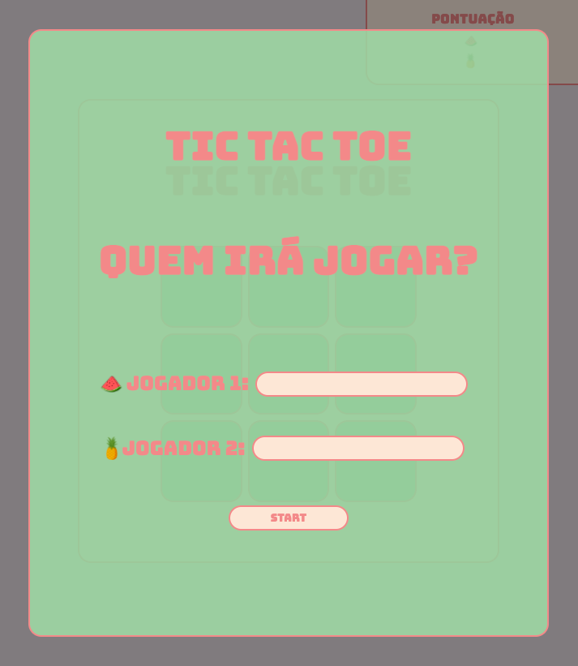
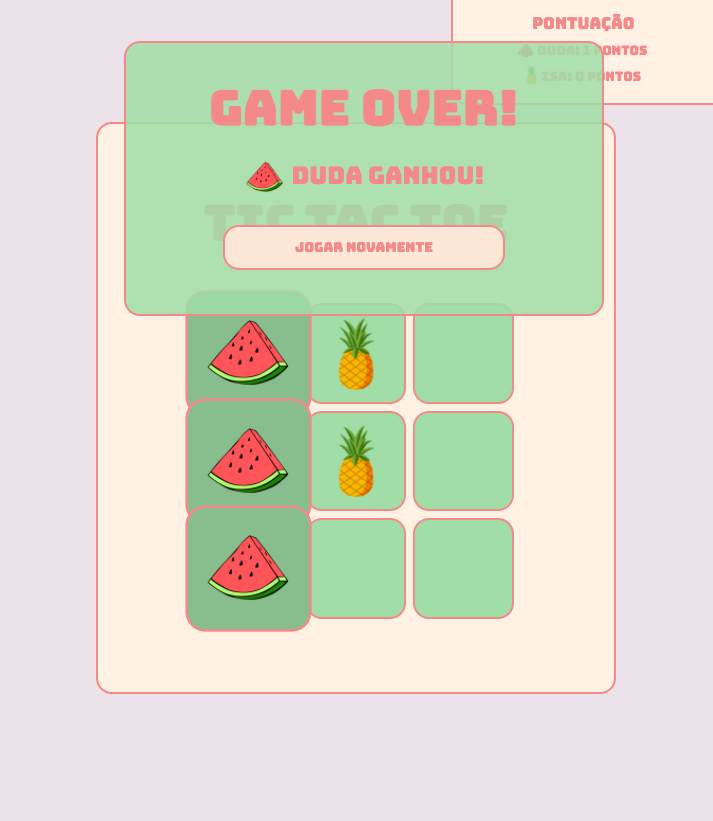
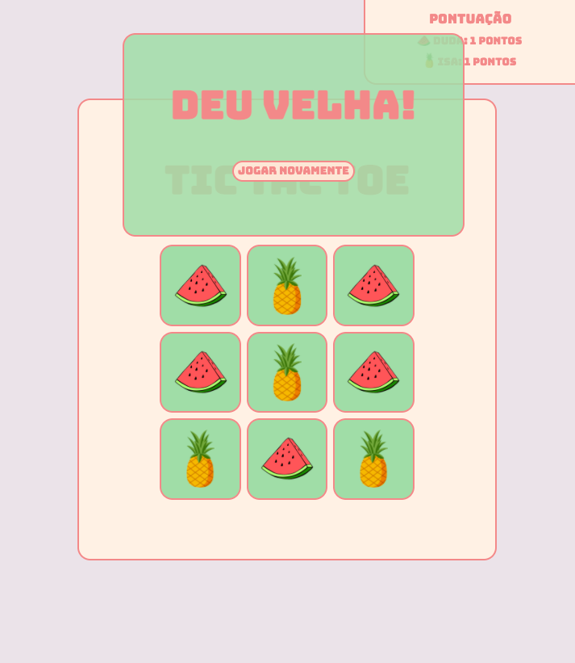
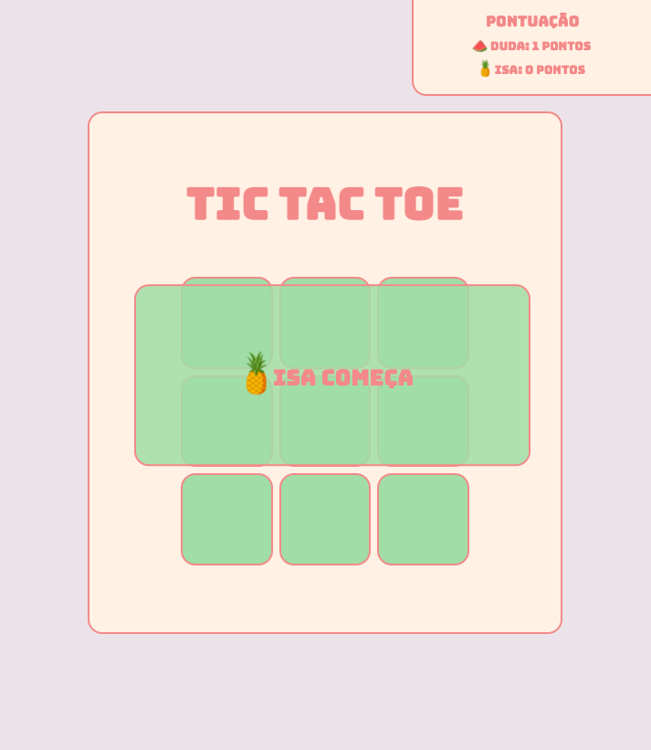

# tic_tac_toe_game

Hello! This is a project I made while learning HTML, CSS and JS.

Features in this game:
- Start page where the players can write their names;
- Card to inform which player starts the round;
- Game over card that informs who won with a button to start again;
- Tied game card with a button to start again;
- Point counter that informs how many points each player has scored.

Pictures:

First page:

Game over page:

Game tied page:

Player's turn page:

Thanks for the interest!
